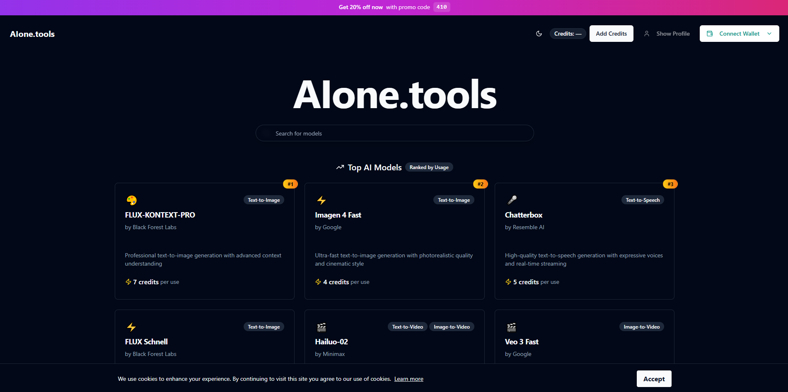

# AIone.tools - Decentralized AI Platform



## [Production website](https://aione.tools/)

> **Full-Stack AI Platform** - A comprehensive Web3-powered AI platform providing seamless access to cutting-edge AI models with Solana blockchain integration

[](https://nextjs.org/)
[](https://www.typescriptlang.org/)
[](https://tailwindcss.com/)
[](https://supabase.com/)
[](https://solana.com/)

## Project Overview

AIone.tools is a modern, decentralized AI platform that democratizes access to state-of-the-art artificial intelligence models through Web3 technology. Built with a credit-based system powered by Solana blockchain, it provides a seamless interface to interact with multiple AI services including image generation, video creation, text-to-speech, document analysis, and specialized chat interfaces.

<details>
  <summary>Click here to see the Overview Images</summary>
  <br>
  <p align="center">
    
    
    
  </p>
</details>

**Key Achievements:**
- **15+ AI Models** integrated from leading providers (Google, Minimax, Black Forest Labs, Replicate)
- **Web3 Integration** with Solana wallet connectivity and SOL payments
- **Credit-based system** with secure blockchain transactions
- **Real-time processing** with progress tracking and error handling
- **Responsive design** optimized for mobile and desktop
- **Dynamic model ranking** based on usage statistics

## Architecture & Tech Stack

### Frontend
- **Next.js 14** with App Router and React 18
- **TypeScript** for type safety and enhanced development experience
- **Tailwind CSS** for responsive, utility-first styling
- **Radix UI** components for accessible, customizable UI primitives
- **Lucide React** for consistent iconography
- **React Hook Form** with Zod validation

### Backend & Database
- **Supabase** for authentication, database, and real-time features
- **PostgreSQL** with Row Level Security (RLS)
- **Server-side API routes** for AI model integrations
- **Edge Functions** for serverless AI processing

### Web3 & Blockchain
- **Solana Web3.js** for blockchain interactions
- **Wallet connectivity** supporting multiple Solana wallets
- **SOL payments** for credit purchases
- **Decentralized user management**

### AI Integrations
- **Google AI** (Imagen 4, Gemini 2.5, Veo 3)
- **Minimax** (Hailuo-02 video, Speech-02 Turbo)
- **Black Forest Labs** (FLUX models)
- **Replicate** (Various open-source models)
- **Custom AI endpoints** for specialized tasks

## Core Features

### AI Model Access
- **Text-to-Image Generation** with multiple FLUX and Imagen models
- **Video Generation** including text-to-video and image-to-video
- **Text-to-Speech** with high-quality voice synthesis
- **Chat Interfaces** including specialized chef chat
- **PDF Summarization** with document analysis
- **Image Enhancement** and manipulation tools

### Web3 Authentication & Security
- **Solana Wallet Integration** with multiple wallet support
- **Decentralized Identity** management
- **Secure Transactions** via blockchain
- **Row Level Security** in database
- **API Rate Limiting** and usage tracking

### Credit System
- **SOL-based Payments** for credit purchases
- **Dynamic Pricing** based on model complexity
- **Usage Analytics** and credit tracking
- **Promo Code System** with flexible discount options
- **Real-time Balance Updates**

### User Experience
- **Responsive Design** across all devices
- **Dark/Light Theme** support
- **Real-time Progress** tracking for AI generations
- **Model Statistics** and popularity rankings
- **Intuitive Navigation** with search functionality

## Technical Implementation

### State Management
- **React Hooks** for local state management
- **Custom Hooks** for wallet and user data
- **Real-time Updates** via Supabase subscriptions
- **Optimistic UI Updates** for better UX

### API Integration Pattern
```typescript
// Example AI model integration
const generateImage = async (prompt: string, modelId: string) => {
  const response = await fetch('/api/generate-image', {
    method: 'POST',
    headers: { 'Content-Type': 'application/json' },
    body: JSON.stringify({ prompt, modelId, userId })
  });
  return response.json();
};
```

### Web3 Integration
```typescript
// Solana wallet connection
const connectWallet = async () => {
  const { solana } = window;
  if (solana?.isPhantom) {
    const response = await solana.connect();
    return response.publicKey.toString();
  }
};
```

## Features Showcase

### AI Model Interface
- **Dynamic Model Cards** with real-time statistics
- **Category Filtering** and search functionality
- **Usage-based Ranking** system
- **Model Comparison** tools

### User Dashboard
- **Credit Balance** and transaction history
- **Generation History** with result gallery
- **Usage Analytics** and statistics
- **Profile Management** with Web3 integration

### Admin Features
- **Model Management** and configuration
- **User Analytics** and usage tracking
- **Promo Code Management** system
- **Revenue Analytics** dashboard

## API Endpoints

### Authentication
- `POST` - Wallet-based authentication
- `GET` - User profile data
- `PUT` - Credit balance updates

### AI Models
- `POST` - Image generation
- `POST` - Video generation
- `POST` - Audio synthesis
- `POST` - Chat completions

### Analytics
- `GET` - Platform statistics
- `GET` - Model popularity data
- `POST` - Usage tracking

## Performance Optimizations

- **Image Optimization** with Next.js Image component
- **Code Splitting** for reduced bundle sizes
- **API Caching** with intelligent invalidation
- **Lazy Loading** for model interfaces
- **Progressive Web App** capabilities

## Web3 Features

- **Multi-Wallet Support** (Phantom, Solflare, etc.)
- **Blockchain Transactions** for credit purchases
- **Decentralized Storage** integration ready
- **Smart Contract** interaction capabilities

## Analytics & Monitoring

- **Real-time Usage** tracking
- **Model Performance** metrics
- **User Engagement** analytics
- **Revenue Tracking** and reporting

## Security Features

- **Row Level Security** in database
- **API Rate Limiting** per user
- **Input Validation** with Zod schemas
- **Secure File Uploads** with type checking
- **CORS Protection** and security headers

## Project Statistics

- **15+ AI Models** integrated
- **6 Different AI Categories** supported
- **Web3 Wallet Integration** with Solana
- **Real-time Analytics** dashboard
- **Responsive Design** for all devices
- **TypeScript Coverage** 100%

## Design System

- **Consistent UI Components** with Radix UI
- **Design Tokens** via Tailwind CSS
- **Accessibility First** approach
- **Mobile-Responsive** layouts
- **Dark/Light Theme** support

## Future Enhancements

- **NFT Integration** for generated content
- **DAO Governance** for platform decisions
- **Multi-chain Support** beyond Solana
- **Advanced Analytics** with ML insights
- **API Marketplace** for third-party integrations

## License

This project is private and proprietary under the MIT License - see the [LICENSE](LICENSE) file for details.

## About the Developer

Built with expertise in modern web technologies, blockchain integration, and AI platform development. Showcasing skills in:

- **Full-Stack Development** with Next.js and TypeScript
- **Web3 Integration** with Solana blockchain
- **AI/ML Integration** with multiple providers
- **Database Design** with PostgreSQL and Supabase
- **UI/UX Design** with modern design principles
- **DevOps & Deployment** with cloud platforms

## About the Development Team

### Artin Ebrahim Khani
- **Contact**: [Artin@prstg.net](mailto:Artin@prstg.net)

### Mani Mirzaei
- **Contact**: [Mani@prstg.net](mailto:Mani@prstg.net)

---

*This README showcases a production-ready, full-stack AI platform demonstrating advanced technical skills in modern web development, blockchain integration, and AI technology.*